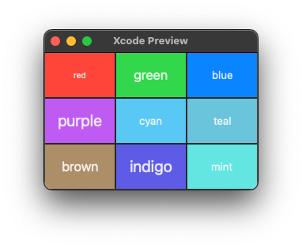
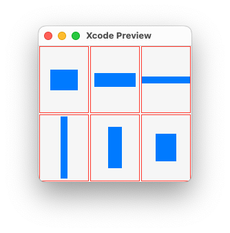
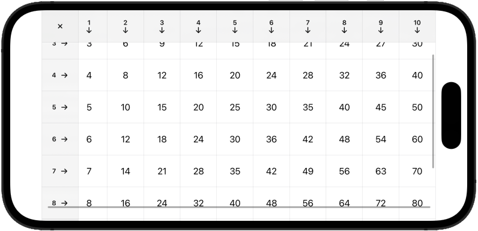
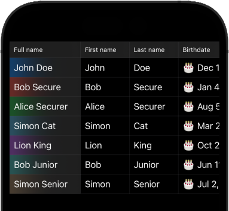

# SwiftUI Simple Table


## 📝 Description

SwiftUI table view, which works on **iOS** and **macOS**.

- ✅ Simple to use (check out included examples).
- ✅ Displays **all columns** on iOS, even when the horizontal size class is compact.
- ✅ Supports vertical and **horizontal** scrolling (or no scrolling at all if that's what you need).
- ✅ Supports **"sticky" headers** (with `.simpleTableHeader()` view modifier).
- ✅ Allows configuring column/row size: equal heights, equal widths, or constrained aspect ratio.

## 🏛 Project structure

```
swiftui-simple-table (Swift Package)
 └─ SimpleTable (Library)
```

## 📖 Usage

Use [Swift Package Manager](https://swift.org/package-manager/) to add `SimpleTable` as a dependency to your project.

Check out included examples:

### ▶️ Colors table example

- Source code: [Sources/SimpleTable/Examples/ColorsTableExample.swift](Sources/SimpleTable/Examples/ColorsTableExample.swift)



### ▶️ Shapes table example

- Source code: [Sources/SimpleTable/Examples/ShapesTableExample.swift](Sources/SimpleTable/Examples/ShapesTableExample.swift)



### ▶️ Multiplication table example

- Source code: [Sources/SimpleTable/Examples/MultiplicationTableExample.swift](Sources/SimpleTable/Examples/MultiplicationTableExample.swift)



### ▶️ People table example

- Source code: [Sources/SimpleTable/Examples/PeopleTableExample.swift](Sources/SimpleTable/Examples/PeopleTableExample.swift)



## 🛠 Develop

- Use Xcode (version ≥ 14).
- Clone the repository or create a fork & clone it.
- Open `Package.swift` in Xcode
- Use `SimpleTable` scheme for building the library.
- If you want to contribute:
    - Create a pull request containing your changes or bugfixes.

## ☕️ Do you like the project?

<a href="https://www.buymeacoffee.com/darrarski" target="_blank"></a>

## 📄 License

Copyright © 2023 Dariusz Rybicki Darrarski

License: [MIT](LICENSE)
